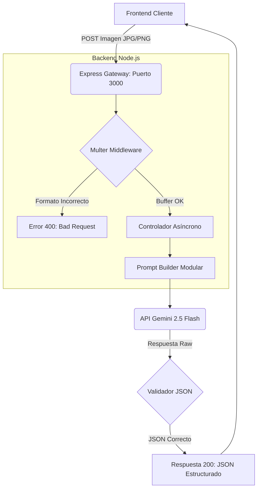

# 🚀 Fisimat AI Tutor API


Microservicio backend diseñado para la resolución automatizada de problemas de física y matemáticas mediante Reconocimiento Óptico de Caracteres (OCR) e IA Generativa. 

Este proyecto aplica una arquitectura modular y asíncrona, sentando las bases para integraciones robustas de procesamiento de documentos (similares a arquitecturas empresariales de análisis de imágenes).

---

## 🏗️ Arquitectura del Sistema

El flujo de procesamiento garantiza que las entradas (imágenes) sean validadas antes de consumir tokens de la API de inteligencia artificial.



---

## 📄 Contrato de la API (Endpoints)

### 1. Health Check
Verifica que el contenedor o servidor esté en línea.
- **URL:** `/api/health`
- **Método:** `GET`
- **Respuesta Exitosa (200 OK):**
  ```json
  {
    "status": "OK",
    "message": "Fisimat API funcionando al 100%"
  }
  ```

### 2. Resolución de Problemas (OCR + Solución)
Recibe la imagen del problema y devuelve la solución estructurada paso a paso.
- **URL:** `/api/solve`
- **Método:** `POST`
- **Headers:** `Content-Type: multipart/form-data`
- **Body:**
  - `imagen` (File): Archivo de imagen a analizar.
- **Respuesta Exitosa (200 OK):**
  ```json
  {
    "exito": true,
    "solucion": {
      "tema_identificado": "Cinemática",
      "datos_extraidos": ["d = 10m", "t = 2s"],
      "pasos_de_solucion": ["Paso 1: Usar la fórmula v = d/t..."],
      "resultado_final": "5 m/s"
    }
  }
  ```

---

## ⚙️ Instalación y Entorno Local

1. Clonar el repositorio.
2. Instalar dependencias:
   ```bash
   npm install
   ```
3. Crear un archivo `.env` en la raíz con las credenciales:
   ```env
   PORT=3000
   GEMINI_API_KEY=tu_clave_aqui
   ```
4. Levantar el servidor de desarrollo:
   ```bash
   node index.js
   ```

---

## 🗺️ Roadmap y Estado Actual

- [x] **Fase 1:** Configuración de entorno profesional (ESLint, Prettier).
- [x] **Fase 2:** Construcción del servidor base (Express, Multer).
- [x] **Fase 3:** Integración de IA Generativa (Gemini 2.5 Flash SDK) y Prompting Estructurado.
- [ ] **Fase 4:** Cobertura de pruebas automatizadas unitarias e integración (Jest).
- [ ] **Fase 5:** Contenerización de la aplicación (Docker).

> **ADR (Architecture Decision Record) - IA:** > Se optó por usar Google Gemini 2.5 Flash debido a su excelente rendimiento en lectura de documentos (OCR) y latencia optimizada, alineándose con los estándares de herramientas de validación de seguridad empresariales.
